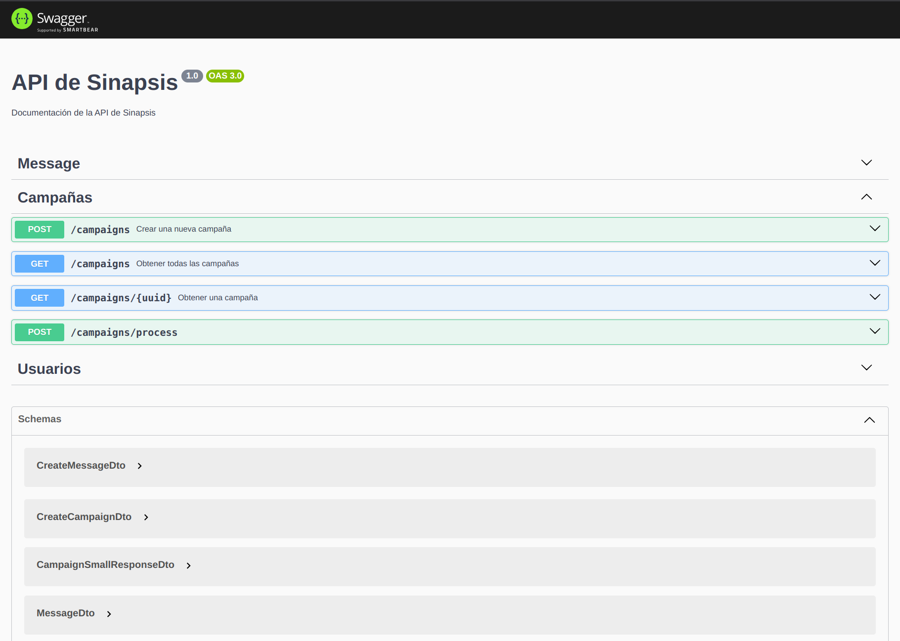

# Reto Técnico Sinapsis - Backend

## 🚀 Tecnologías utilizadas

- AWS Lambda
- Serverless
- NestJS

## 📦 Instalación

```bash
git clone git@github.com:david986912425/sinapsis-serverless-nest.git
cd sinapsis-serverless-nest

npm install
```

Si no tiene Mysql puede correrlo con docker compose
```bash
docker compose up 
```
## Local Offline Development

```bash
# Si deseas iniciar el servidor local pero conectándote a una base de datos MySQL en línea:
$ npm run sls:offline
```

## Documentacion
```sh
http://localhost:3000/dev/api-docs
```
